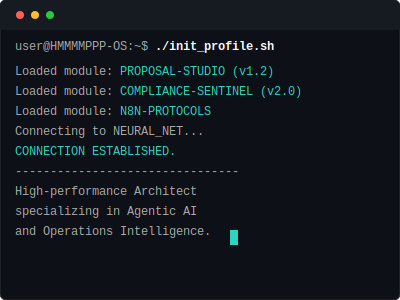
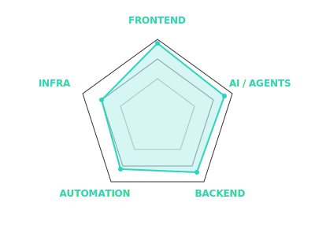

  

 

<!-- Activity Graph -->

  

 

<!-- Mission Control Dashboard -->
<table width="100%" style="border: none;">
  <tr>
    <td colspan="2" align="center">
      <h3>🚀 CLASSIFIED MISSIONS</h3>
    </td>
  </tr>
  
  <!-- ROW 1 -->
  <tr>
    <td width="50%" valign="top">
      <h3 align="center">📂 PROPOSAL STUDIO</h3>
      

         
        
      

       
      > <strong>"The War Room for Proposals."</strong> 
      > Autonomous agentic system that drafts, critiques, and refines winning proposals.
        
      

        
        
        
      

       
      

        <a href="https://github.com/HMMMMPPP/proposal-studio"><strong>[ ACCESS FILE ]</strong></a>
      

    </td>
    
    <td width="50%" valign="top">
      <h3 align="center">📂 COMPLIANCE SENTINEL</h3>
      

        
        
      

       
      > <strong>"The 24/7 Auditor."</strong> 
      > Automated pipeline ensuring zero-defect legal documents. Audits 500+ contracts in < 2 mins.
        
      

        
        
      

       
      

        <a href="https://github.com/HMMMMPPP/compliance-sentinel"><strong>[ ACCESS FILE ]</strong></a>
      

    </td>
  </tr>

  <!-- ROW 2 -->
  <tr>
    <td width="50%" valign="top">
      <h3 align="center">📂 INTERACTIVE HUB</h3>
      

        
        
      

       
      > <strong>"The Holographic Interface."</strong> 
      > A 3D immersive web experience acting as the central hub.
        
      

        
        
      

       
      

        <a href="https://github.com/HMMMMPPP/personal-website"><strong>[ ACCESS FILE ]</strong></a>
      

    </td>

    <td width="50%" valign="top">
      <h3 align="center">📂 AUTOMATION PROTOCOLS</h3>
      

        
        
      

       
      > <strong>"The Nervous System."</strong> 
      > Collection of n8n automation workflows for data piping and integrations.
        
      

        
        
      

       
      

        <a href="https://github.com/HMMMMPPP/n8n-workflows"><strong>[ ACCESS FILE ]</strong></a>
      

    </td>
  </tr>
</table>

 

<!-- Tech Stack & Stats Unified -->
<table width="100%" style="border: none;">
  <tr>
    <td width="60%" valign="top">
      <h3 align="center">📊 LIVE TELEMETRY</h3>
      

        
         
        
      

    </td>
    <td width="40%" valign="top">
      <h3 align="center">⚡ ARSENAL</h3>
      

        
      

    </td>
  </tr>
</table>

<!-- The Snake -->

  

  

 
  
  

