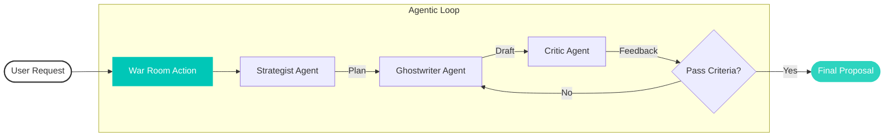

  

 

<!-- Activity Graph: Real-time commit history wave -->

  

 

<!-- Dynamic Stats: Streak & Languages -->

  
  

<!-- The Snake: Eats your contributions (Generated by Action) -->

  

---

## 📂 Classified Projects

 

### 1. [PROPOSAL STUDIO](https://github.com/HMMMMPPP/proposal-studio)
> **Clearance Level**: TOP SECRET // **Status**: DEPLOYED
>
> "The War Room for Proposals." An autonomous agentic system that drafts, critiques, and refines winning proposals for freelancers.

- **Architecture**: Multi-Agent System (Strategist → Ghostwriter → Critic)
- **Tech**: Next.js 16, Vercel AI SDK, Groq (Llama 3.3), Google Gemini 2.5
- **Key Feature**: Real-time streaming of agent thoughts and "War Room" collaboration.

 

### 2. [COMPLIANCE SENTINEL](https://github.com/HMMMMPPP/compliance-sentinel)
> **Clearance Level**: INTERNAL // **Status**: OPERATIONAL
>
> "The 24/7 Auditor." Automated pipeline ensuring zero-defect legal documents.

- **Performance**: Audits 500+ contracts in < 2 minutes.
- **Tech**: Python 3.14, Regex Patterns, PDF Parsing Automation.

 

### 3. [INTERACTIVE SYSTEM](https://github.com/HMMMMPPP/personal-website)
> **Clearance Level**: PUBLIC // **Status**: ONLINE
>
> A 3D immersive web experience acting as the central hub.

- **Tech**: React Three Fiber, Vite, TailwindCSS v4.
- **Experience**: Holographic interface with dynamic content loading.

 

### 4. [AUTOMATION PROTOCOLS](https://github.com/HMMMMPPP/n8n-workflows)
> **Clearance Level**: RESTRICTED // **Status**: RUNNING
>
> "The Nervous System." Collection of n8n automation workflows for data piping and integrations.

 

### 5. [INTELLIGENCE DATABASE](https://github.com/HMMMMPPP/public-apis)
> **Clearance Level**: PUBLIC // **Status**: INDEXED
>
> "The Knowledge Base." A curated list of public APIs for building connected systems.

---

## 📊 Live Telemetry

  

  <h3>⚡ Tech Stack</h3>
  
  
  
  
  
  
   
  
  
  
  
   
  
  
  
  

 
  
  

